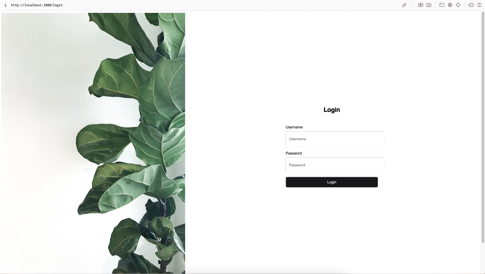

# React-Nestjs Take Home Assignment

## Getting started 🚀

Clone this repository

```zsh
git clone https://github.com/pandakn/react-nest-take-home.git

cd react-nest-take-home
```

Install dependencies using `npm`

```zsh
cd client
npm install

cd server
npm install
```

After this step, you will get `node_modules` folder in the root of the project.

### Start Docker Compose for Database 🐳

```zsh
docker-compose -p blog-take-home-dev -f docker-compose-dev.yml up -d
```

### Setup .env for Database 🐳

```zsh
// Create a `.env` file in the root of the project.
touch .env

// .env
POSTGRES_HOST=host.docker.internal
POSTGRES_PORT=5432
POSTGRES_USER=pandakn
POSTGRES_PASSWORD=secretpassword
POSTGRES_DB=blog_take_home
```

### Setup .env for Client 👀

```zsh
cd client
touch .env

// .env
VITE_API_URL=http://localhost:8080
```

### Setup .env for Server 🌐

```zsh
cd server
touch .env

// .env
NODE_ENV=development
APP_PORT=8080

PUBLIC_KEY=GP+ycIZcNictqKJcKzlAFdMFhshX60n3K8Q6LQjPxDA

POSTGRES_HOST=localhost
POSTGRES_PORT=5432
POSTGRES_USER=pandakn
POSTGRES_PASSWORD=secretpassword
POSTGRES_DB=blog_take_home

# cli for generate a secure random string -> `openssl rand -base64 32`
JWT_SECRET_KEY=KFSBsWrhiNipEf2g/4Slh2jREDw0mtFKwFfu+DWXrog
```

> **Note** : You can find all `.env` file configurations in `.env.example` each folder

### Start Client 👀

```zsh
cd client

npm run dev
```

The frontend will run at [localhost:3000](http://localhost:3000) or you can port change

### Start Server 🌐

```zsh
cd server

npm run start:dev
```

The backend will run at [localhost:8080](http://localhost:8080) or you can port change

### Run Seed Data 🌱

```zsh
cd server

npm run seed:run
```

### How to run test backend 🧪

```zsh
cd server

npm run test
```

> **Note** : This test for `users.service.ts` is so simple because I am learning unit testing and TDD. I'm ready to improve myself.

### Mock User for Login

    username: takehome
    password: 12345678

# Screenshot 📸




